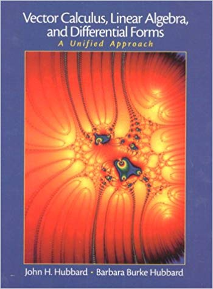

# newton-fractals
This is a short code to generate fractals using <a href="https://en.wikipedia.org/wiki/Newton%27s_method">Newton's Method</a> - an algorithm for iteratively approximating the zeros of nonlinear functions. 

I was inspired to make this repo by this book, which I highly recommend.

